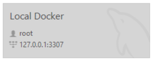

# Creating the staging database

## Part 1: Setting Up the Development Database

To begin, set up a MySQL database locally using Docker. Follow these steps to create and run the container:

### Step 1: Start MySQL in Docker

Run the following command to start a MySQL container locally on port 3307:

```bash
docker run --name docker_crowdfund_db -e MYSQL_DATABASE=crowdfund_db -e MYSQL_ROOT_PASSWORD=[password] -p 3307:3306 -d mysql
```

:::warning
    Change [password] for your MySQL root password.
:::


Once the container is running, it will have the MySQL database (`crowdfund_db`) created, and you can access it through any database management tool.



## Part 2: Creating the Database Tables

After setting up the MySQL container, you need to create the tables for the project. Use the following SQL script to define the database structure.

### Step 2: Run the SQL Script

Connect to the MySQL container and execute the following SQL commands to create the necessary tables:

```sql
USE crowdfund_db;

-- Table: Users
CREATE TABLE Users (
    id INT PRIMARY KEY,  
    name VARCHAR(100) NOT NULL,
    email VARCHAR(100) UNIQUE NOT NULL,
    password VARCHAR(100) NOT NULL
);

-- Table: Projects
CREATE TABLE Projects (
    id INT PRIMARY KEY,
    name VARCHAR(255) NOT NULL,
    description TEXT NOT NULL,
    location VARCHAR(255),
    type VARCHAR(100),
    dateCreated TIMESTAMP DEFAULT CURRENT_TIMESTAMP,
    user_id INT NOT NULL,
    fundingGoal FLOAT NOT NULL,
    moneyRaised FLOAT NOT NULL,
    FOREIGN KEY (user_id) REFERENCES Users(id) ON DELETE CASCADE
);

-- Table: Payments
CREATE TABLE Payments (
    id INT PRIMARY KEY,
    project_id INT NOT NULL,
    user_email VARCHAR(100) NOT NULL,
    amount DECIMAL(10, 2) NOT NULL,
    payment_date TIMESTAMP DEFAULT CURRENT_TIMESTAMP,
    FOREIGN KEY (project_id) REFERENCES Projects(id) ON DELETE CASCADE,
    FOREIGN KEY (user_email) REFERENCES Users(email)
);

-- Table: ProjectImages
CREATE TABLE ProjectImages (
    id INT PRIMARY KEY,
    project_id INT NOT NULL,
    image_url VARCHAR(255) NOT NULL,
    FOREIGN KEY (project_id) REFERENCES Projects(id) ON DELETE CASCADE
);
```

## Part 3: Final Steps

Once the SQL script is executed, the database schema for the project will be ready, and the tables will be created.

Now you have a fully running container with the database and all the required tables, and you're ready for development.
