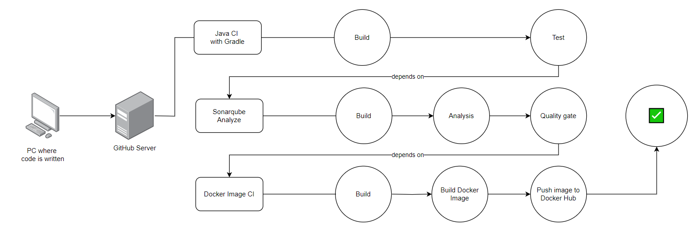

# Back-end pipeline diagram

The diagram illustrates a CI/CD pipeline process involving multiple stages:

1. **Code Submission**:
   - Developers write code on their local PC and push it to a GitHub server.

2. **Docker Image CI**:
   - **Build**: The pipeline builds the Docker image.
   - **Build Docker Image**: The Docker image is built.
   - **Push Image to Docker Hub**: The built Docker image is pushed to Docker Hub for storage.

3. **Java CI with Gradle**:
   - **Build**: The Java project is built using Gradle.
   - **Test**: The application is tested to ensure code quality and functionality.

4. **SonarQube Analyze**:
   - **Build**: The code undergoes a build process for analysis.
   - **Analysis**: SonarQube analyzes the code for bugs, vulnerabilities, and code smells.
   - **Quality Gate**: A quality gate determines whether the code meets predefined quality standards.

5. **Final Outcome**:
   - If all steps succeed (Docker, Gradle, and SonarQube checks), the pipeline passes ✅.
   - If any step fails, the pipeline fails ❌.