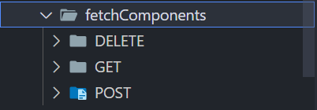

# Data Retrieval Components

To make the project more adaptable in the future, I built React components that focus on getting data and handling communication with the back-end. By using this modular setup, we can easily update or change how we get data without needing to rewrite a lot of code. This makes it simpler to adjust to new requirements as they come up.

