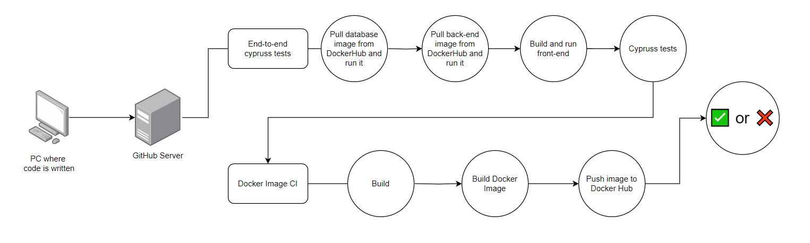

# Front-end pipeline diagram

1. **Docker Image CI**:
   - **Build**: The pipeline builds the Docker image.
   - **Build Docker Image**: The Docker image is built.
   - **Push Image to Docker Hub**: The built Docker image is pushed to Docker Hub for storage.

<!-- TO-DO: Add more steps if done-->