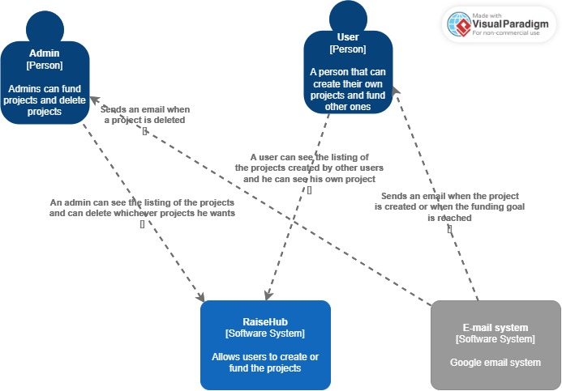

# C1: System Context Diagram

The diagram provides a basic overview of the **"RaiseHub"** system, a platform that allows users to create and fund projects. It shows interactions with three primary actors and systems:

1. **Admin [Person]**:  
   An admin can perform management tasks, such as funding projects and deleting any projects in the system. Admins receive notifications via email when a project is deleted.

2. **User [Person]**:  
   A user can create new projects, fund other projects, and view existing projects in the system. When a new project is created or a project reaches its funding goal, the user is notified via email.

3. **E-mail System [Software System]**:  
   A third-party email service (e.g., Google email system) used for sending notifications to users and admins regarding project status updates and deletions.

The central system in this diagram is **RaiseHub [Software System]**, which facilitates these interactions by allowing users to create and fund projects.
