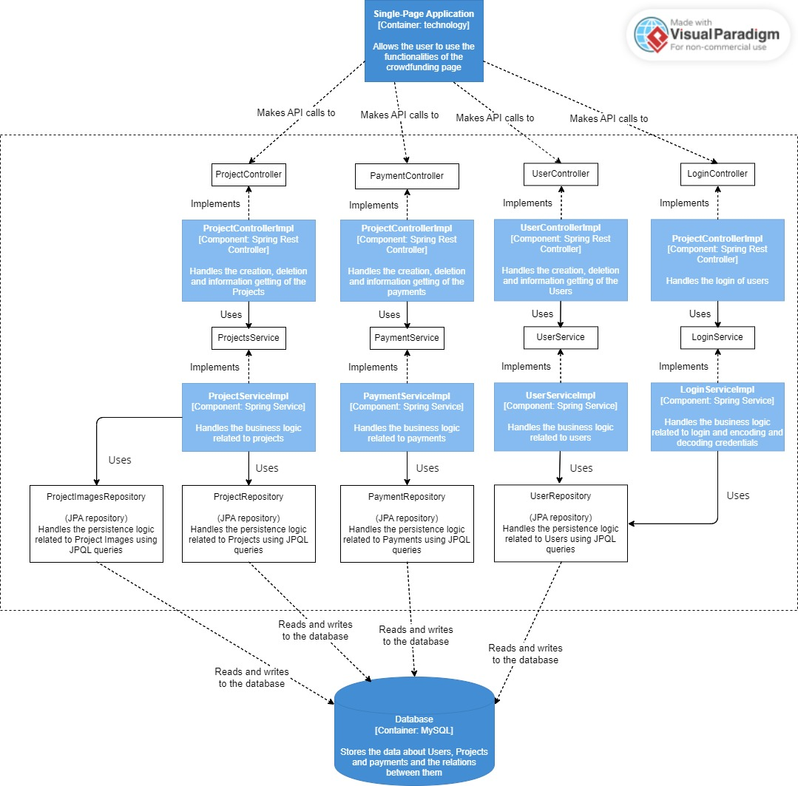

# C3: Component Diagram for the API Application

The diagram provides a detailed breakdown of the internal structure of a specific container, focusing on the components within the **API Application**. It highlights the key components responsible for handling various functionalities (User, Project, and Payment management) and their interactions with the database.

## MAIN COMPONENTS:
1. **Single-Page Application (SPA)**:  
   - The front-end SPA interacts with the backend by making API calls to various controllers. These controllers expose different functionalities of the system, such as managing users, projects, and payments.

2. **Controllers (UserController, ProjectController, PaymentController)**:  
   - The Controllers serve as entry points for API requests. Each controller manages a specific domain:  
     - **UserController**: Manages user-related functionalities such as user creation, deletion, and information retrieval.  
     - **ProjectController**: Manages project-related functionalities, including creation, deletion, and information retrieval.  
     - **PaymentController**: Handles payment-related operations, such as processing payments and retrieving payment information.
     - **PaymentController**: Handles login-related operations, such as checking credentials and decrypting tokens.

3. **Service Layer (UserService, ProjectService, PaymentService)**:  
   - The Service Layer encapsulates the business logic for each domain. It acts as an intermediary between the controllers and the repository layer:  
     - **UserServiceImpl**: Implements business logic related to user management.  
     - **ProjectServiceImpl**: Manages the business logic for project-related operations.  
     - **PaymentServiceImpl**: Handles the business logic for payment processing.  
     - **LoginServiceImpl**: Handles the business logic for checking credentials and its encryption.  

   - By using service interfaces (e.g., UserService, ProjectService), the system adheres to the **Dependency Inversion Principle**, where higher-level modules depend on abstractions rather than concrete implementations.

4. **Repository Layer (ProjectImageRepository, ProjectRepository, PaymentRepository, UserRepository)**:  
   - The Repository Layer handles direct interactions with the database. It is responsible for reading from and writing to the database:  
     - **ProjectImageRepositoryImpl**: Handles data access for images related to projects.  
     - **ProjectRepositoryImpl**: Handles data access for project entities.  
     - **PaymentRepositoryImpl**: Handles data access for payment entities.  
     - **UserRepositoryImpl**: Handles data access for user entities.  

   - This layer abstracts the data access details from the service layer, following the **Single Responsibility Principle (SRP)**, where the repository’s sole responsibility is data management.

5. **Database [Container: MySQL]**:  
   - The Database is the persistent storage for the system, storing all user, project, payments and   links to images.  
   - Each repository interacts with the database to perform CRUD operations (Create, Read, Update, Delete).

## ARCHITECTURAL FLOW:
- The Single-Page Application interacts with the Controllers, which handle incoming requests and delegate processing to the appropriate Service Layer component.
- The Service Layer performs business logic and coordinates with the Repository Layer to access the necessary data.
- The Repository Layer executes data operations on the Database.
- This structure follows a layered architecture, where each layer has a distinct role, enhancing maintainability and scalability.

## APPLICATION OF SOFTWARE PRINCIPLES:
1. **SOLID Principles**:  
   - **Single Responsibility Principle (SRP)**: Each component has a single responsibility. For example, the UserController only handles API requests related to users, while UserServiceImpl contains the business logic for user operations.  
   - **Open/Closed Principle**: The system is designed to be open for extension but closed for modification. New functionalities can be added without changing the existing code, following the interfaces and service structure.  
   - **Liskov Substitution Principle**: The use of interfaces ensures that any implementation of the interface can be used without altering the client code, maintaining consistency.  
   - **Dependency Inversion Principle (DIP)**: Higher-level modules (controllers) depend on abstractions (services) rather than concrete implementations, promoting loose coupling.

2. **DRY (Don't Repeat Yourself)**:  
   - Common functionalities, such as data access, are centralized in the Repository Layer, preventing code duplication across services.

3. **KISS (Keep It Simple, Stupid)**:  
   - The architecture remains simple by organizing components logically and maintaining clear responsibilities. Each layer performs specific tasks, making the overall system easy to understand.
